# これは何
卒業研究に使うプログラムを置いたり、論文を読みながらメモを残したりしています。デバッグの過程やメモなど適当に書いているのでかなり見にくいです。<br>
- プログラムを作成→問題発生→解決<br>

の流れをそのまま残しているので、あまりまとまっていません。最後まで見ると最初に考えていた問題が解決されていたりするかも。

## 10/12 Hll++の論文を読んでみる
### HyperLogLog32(HllOrig)を実装してみる
32ビットのハッシュ関数を使ったHyperLogLogを実装してみた。<br>
→プログラムがバグる<br>
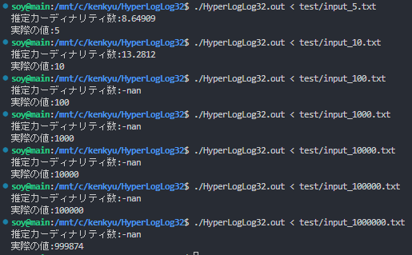<br>

問題点
- n>=100の時、推定カーディナリティ数が-nanとなっている。恐らく値が大きくなりすぎてオーバーフローしている。

何が原因？
- ハッシュ関数が変?<br>
そもそもn=1000000の時、種類数が999874になっているので単射ではなさそう。
- 実装ミス?

今後やりたいこと
- pの値を変更して推定値がどう変化するか見る
- 入力データの値の範囲を変更してみる
- 64ビットverのHyperLogLogも作る
- LogLogや他のカーディナリティ推定アルゴリズムも実装・理解していく

p=4の場合の結果だったので、p=10,p=16についてもそれぞれ調べてみる。

p=10の場合<br>
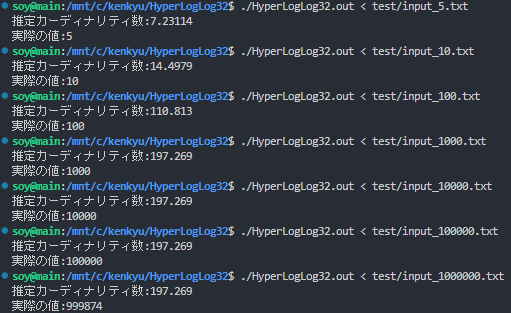<br>

p=4の時と比べると、-nanが無くなった。また、n<=100についてはp=4の時と比べると実際の値と近くなった。

問題点
- n>=1000の時、推定カーディナリティ数が197.269から動かない

何が原因?
- 分からない。HELP

p=16の場合<br>
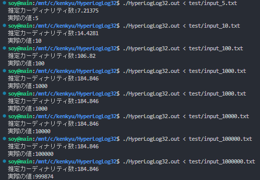<br>

n<=100の時については、より実際の値に近づいた。

問題点
- n>=1000の時、推定カーディナリティ数が184.846から動かない

何が原因?
- 本当に分からない。

### デバッグをする

HyperLogLog32.cppの67行目でV=0に初期化するのを忘れていた。これでもう一度各pについて結果を見てみる。<br>
→変わらなかった

calc_idxでビット長を7にしていた。デバッグ用に変えた時の残骸…。<br>
→ビット長を32に変更したらマシな結果が出てきた。各pについて、改めてまとめてみる。

p=4の場合<br>
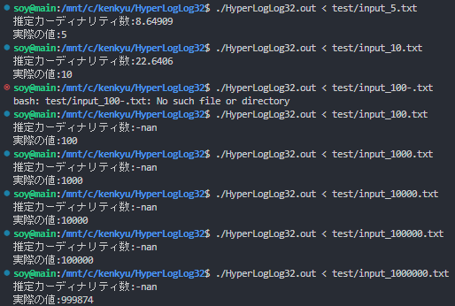<br>

p=10の場合<br>
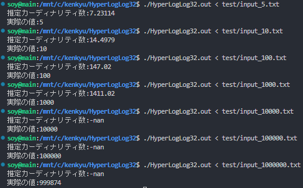<br>

p=16の場合<br>
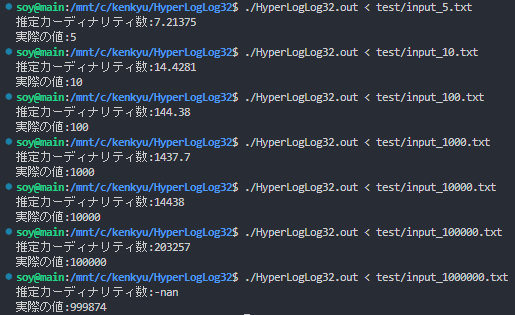<br>

### -nanの原因が判明
```cpp:HyperLogLog32.cpp
else {
  E=-pow(2,32)*std::log2(1-E/std::pow(2,32));
}
```
この部分でEがpow(2,32)を超えてしまうと真数が負数になってしまい、エラーになっていることが分かった。

### 他に間違えていた箇所
Eの計算に用いるamは、mの大きさによって変える必要があったのだが、変更していなかった…。<br>
amを適切に変更した状態で、p=4から見てみる。<br>
→特に変わらなかった。

## 方向転換
Eの値によって補正するパートを一旦無視した状態でEを見てみることにした。

p=4補正無しの場合<br>
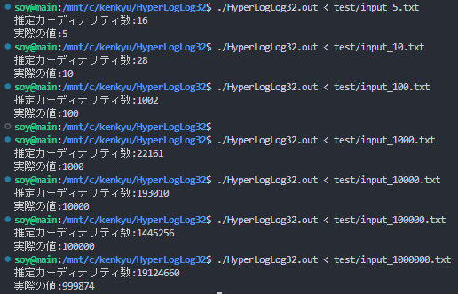<br>

p=10補正無しの場合<br>
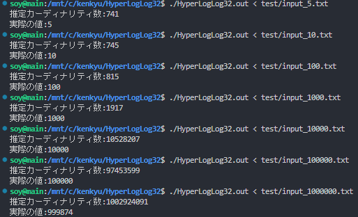<br>

p=16補正無しの場合<br>
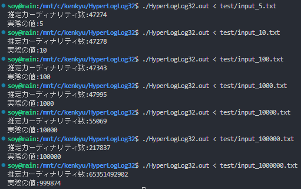<br>

## 10/16 Hll++を読んでみる2
同期の子からハッシュ関数について、HLL++とHLL-βではMD5,MURMUR,SHAを使っているので、そっちに合わせた方がよいのでは、という指摘をもらった(今現在使っているのはxorshift)。<br>
### MD5について
[【MD5って何？】なんでもう使われていないのかまとめてみた！](https://qiita.com/SDTakeuchi/items/821a32501312d5d0b13e)<br>
この記事によると、MD5は現在使われていないらしい。<br>
ハッシュ関数の3つの安全性として、<br>
- 一方向性
- 衝突困難性
- 第二現像計算困難性

がある。<br>
結論から言うと、MD5は衝突困難性が破られてしまったらしい。細かいことは上記の記事に書いてあるので…。

### MurmurHashについて
[MurmurHash](https://en.wikipedia.org/wiki/MurmurHash)に色々書いてある。また、調べてみるとC++で実装したコードをGitHub上に公開している人もいた。

### SHAについて
[Secure Hash Algorithm](https://ja.wikipedia.org/wiki/Secure_Hash_Algorithm)に色々書いてある。正直よくわからない(!?)<br>
32ビット長の出力をしてほしいのだが、256ビット長以上とかしかなくない…？

### とりあえずどうする？
論文を自分であまり読めていないし、これからも読める自信がない(!?)<br>
英語が原因なのか何なのか分からないが、どうも読み進めることができなくて困っている…。<br>
ハッシュ関数の実装はとりあえずxorshitのままにしておいて、他に気になったりやりたいことがあるので、そちらを優先したい。

## 10/12の続き
補正なしでの推定カーディナリティ数を見たところ、いずれのpについても、実際の値よりかなり大きい値が出ることが分かった。<br>
ハッシュ関数を変えるとどれくらい結果に違いが出るのか気になったので、やはりMurmurHashを使ってみる。<br>
[このページ](https://github.com/aappleby/smhasher/blob/master/src/MurmurHash3.cpp)のMurmurHash3のプログラムを使わせていただく。<br>
とりあえずMurmurHash3をプログラムに組み込めたので、p=4,p=10,p=16について、補正なしと補正ありの結果の計6パターンを調べてみる。<br>

p=4補正無し<br>
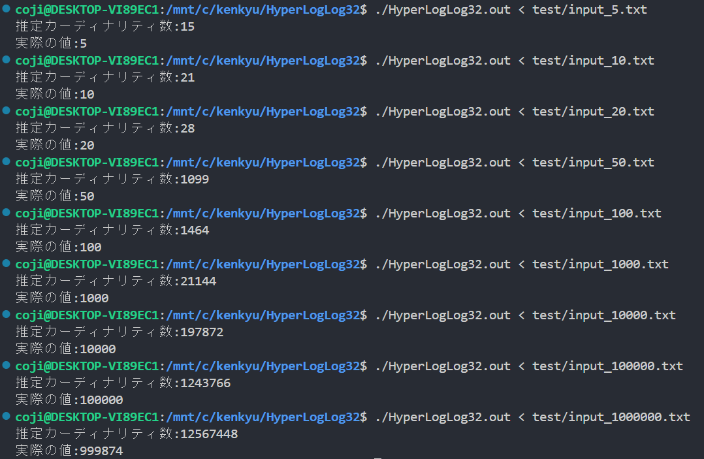<br>

p=10補正無し<br>
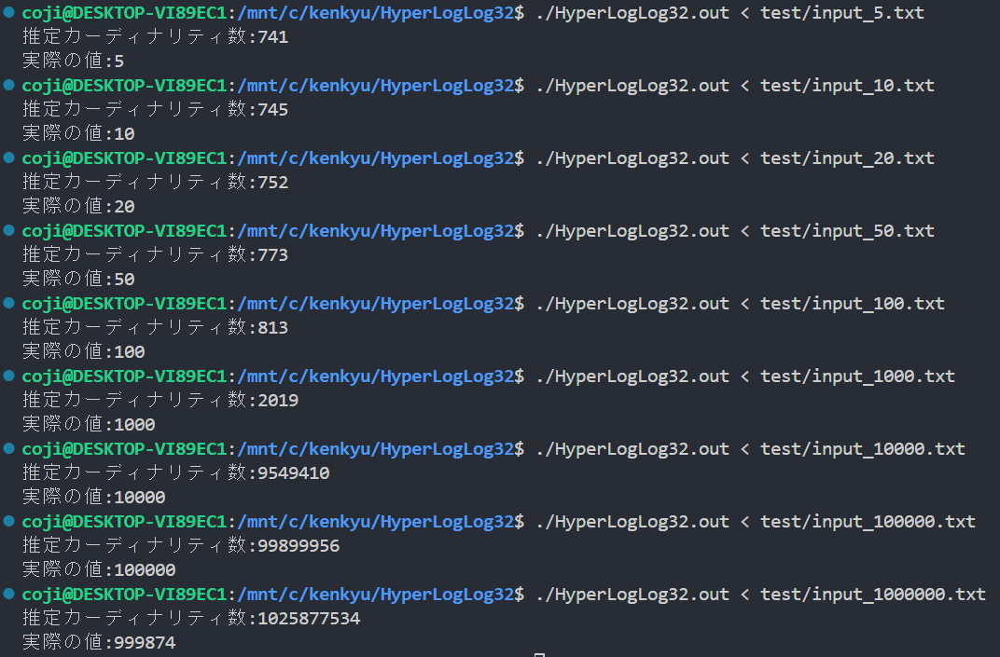<br>

p=16補正無し<br>
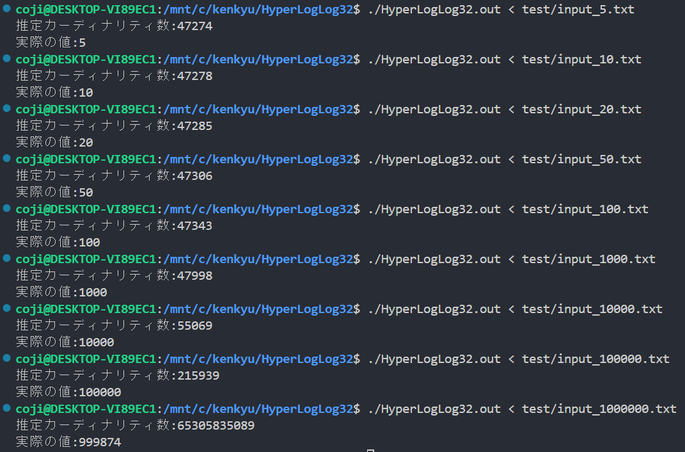<br>

p=4補正あり<br>
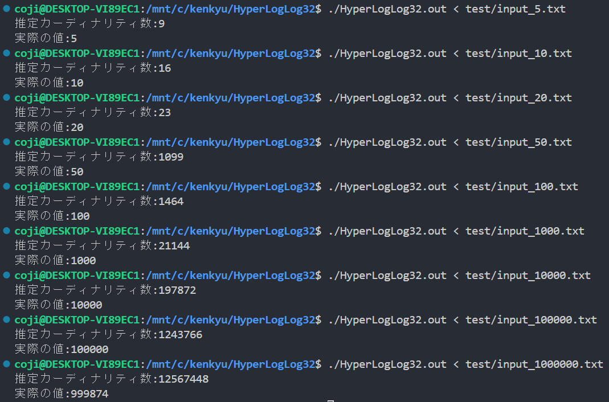<br>

p=10補正あり<br>
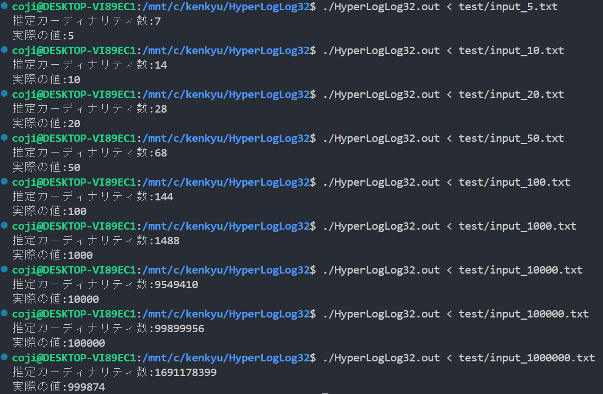<br>

p=16補正あり<br>
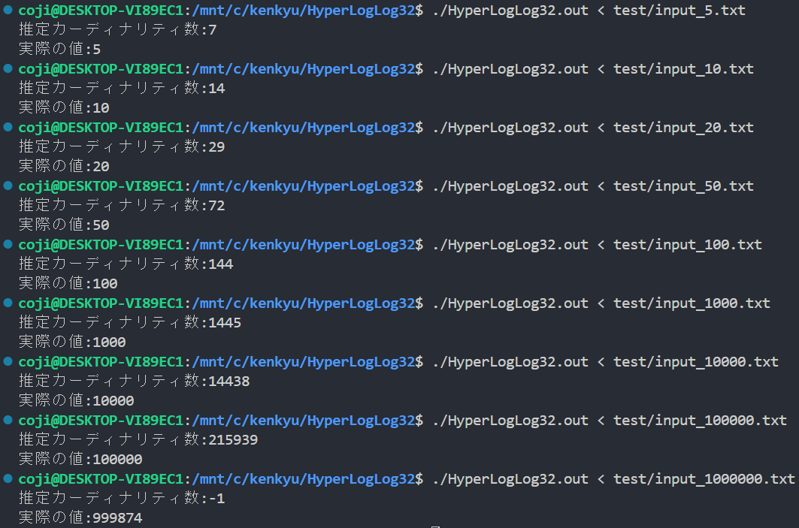<br>
ぱっと見、ハッシュ関数を変えて大きく変わった部分はなさそうに見えるが…。<br>
補正なしと補正ありを比較する。<br>
例えばp=10でn=10000についてみてみる。補正なしの場合は900倍、補正ありの場合は20倍近い推定値が出ている。普通にプログラムにバグがある気がするので見てみる。<br>
→特にバグは見当たらなかった。

### n=0についてのp=4,10,16での推定カーディナリティ数
HllOrigではn=0の時、補正がない状態では常に約0.7mを返すらしいので、確かめてみた。
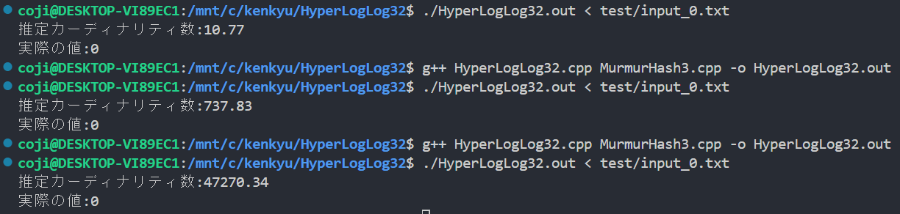<br>
上から順にm=16,1024,65536であり、約0.7mくらいの値になっていることが確認できた。

### カーディナリティが小さい場合の時について
Hll++「推定値の統計的変動はバイアスに比べて小さい。したがって、バイアスを補正できれば、特にカーディナリティが小さい場合に、より良い推定値を得ることが期待できる。」<br>
→言っている意味がよくわからない。統計的変動とバイアスの違いとは…？<br>

## HyperLogLog++で変化した部分について見てみる

### 64bit版HyperLogLogについて考えてみる
64bit版のHyperLogLogも作成して、HLL++の論文内にあるグラフと一致するかどうかを確かめてみたい。<br>
→64bitバージョンの実装、どうするのかわからない…。HLL++に言及されていそう。<br>
→推定するカーディナリティ数が大きくなる場合について対処するためにbitを増やすのであって、誤差が小さくなるわけではなさそう…<br>
と思ったが、なんかHLLOrigで行っている2^32付近での補正を行う必要がなくなった、とか書いてある。そもそもHLLOrigでどういう補正をしていたのかわからないので見直してみる。<br>
→以下のような記述が見つかる。<br>
- n<5m/2では非線形歪みが発生するため、補正が必要であり、LINEARCOUNTINGを使用する
- nがn^32≈4*10^9に近づき始めると、ハッシュの衝突がますます起こりやすくなるので、これを考慮し補正が使用される

この二つ目の問題が64bitのハッシュ関数を用いれば解消できる、という話らしい。そして2^64くらいのデータを扱うことは今のところ考えられないので、64bitの時には上限値(?)付近での補正は考える必要がなくて嬉しい、みたいな感じらしい。<br>
HLL++内でのみ64bitのハッシュを用いたプログラムが書かれているっぽい。少しコードを見た感じ、かなり複雑なので、HLLOrigから64bit部分だけ変化させたプログラムを作成して実験してみるのも良いのかもしれない。<br>

### 精度(p?)について
実験は可能なすべての精度について繰り返す必要がある。しかし、HLL++の論文内では簡潔にしたり、結果が比較的類似したりしている(?)ため、精度14のみを考慮してアルゴリズムを説明するらしい。

### ハッシュ関数について
MD5,Sha1,Sha256,Murmur3やいくつかの独自のハッシュ関数を使ってテストをしたらしいが、いずれかが他よりも優れている、ということはなかったらしい。<br>
同期の子が教えてくれたのはこの部分のことだったっぽい。

### 経験的バイアス補正(図2)について
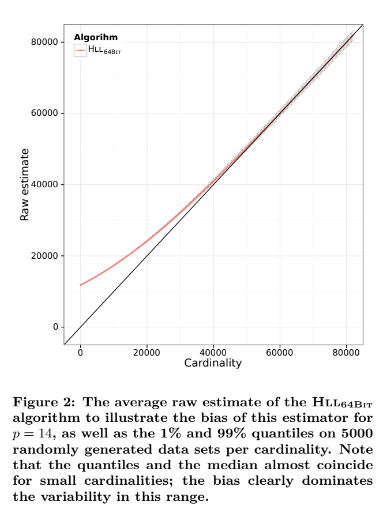<br>
各カーディナリティ数について、5000回ランダムにデータセットを生成。この時、p=14として、生の推定値(つまり補正なしの推定値)の平均値を1%と99%の分位数(赤い線)とともに示している。<br>
→なぜ1%と99%なのだろうか。<br>
そしてHll64bitとあるが、Eが2^32付近の補正はどうしているのか、記述がない<br>
→n<5m/2の時にLINEARCOUNTINGを使っているだけ？

### k-最近傍補間について
Hll++「生の推定値から適切なバイアス補正を検索するために、すべてのカーディナリティについて、生の推定値とバイアスを記録する。<br>
これを実用的にするために、200のカーディナリティを補間点として選び、その平均生推定値とバイアスを記録する。<br>
与えられた生推定値(k=6の場合)のバイアスを求めるためにk-最近傍補間を使用する。<br>
図6の疑似コードでは、最近傍補間を実行する手続きをEstimateBiasとしている。」<br>
言いたいことの気持ちは何となくわかった。<br>
ただ、図6のEstimateBiasが下図のようになっている。<br>
<br>
これだとどう補間しているのかよくわからないので、今後の言及を待ちたい。

#### 以下メモ
- 現在のテストケースについては、メルセンヌ・ツイスタを用いて[0, (2^32)-1] の一様分布整数を生成している。これを正規分布とかにした結果も後々調べる(HLL内に言及あり…？)<br>
→「ハッシュ関数が適切なランダム化を保証する限り、入力セットの分布は関係ないはずである」と書いてあった。よくわからないが、与えるデータセットは完全にランダムに生成する、ということでよさそう。
- 補正なしと補正ありの結果から分かるように、補正の効果はかなり強力だと分かる。
- 各補正に使われているアルゴリズムのうち、LINEARCOUNTINGなど分かりやすいものを深掘りしていきたい。
- n=0の時についてのEの値が0.7mとかになるらしいので、実際に確かめてみたい<br>
→確かめた