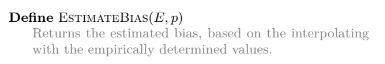
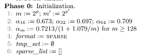

# これは何
卒業研究に使うプログラムを置いたり、論文を読みながらメモを残したりしています。デバッグの過程やメモなど適当に書いているのでかなり見にくいです。<br>
- プログラムを作成→問題発生→解決<br>

の流れをそのまま残しているので、あまりまとまっていません。最後まで見ると最初に考えていた問題が解決されていたりするかも。

## 10/12 Hll++の論文を読んでみる
### HyperLogLog32(HllOrig)を実装してみる
32ビットのハッシュ関数を使ったHyperLogLogを実装してみた。<br>
→プログラムがバグる<br>
<br>

問題点
- n>=100の時、推定カーディナリティ数が-nanとなっている。恐らく値が大きくなりすぎてオーバーフローしている。

何が原因？
- ハッシュ関数が変?<br>
そもそもn=1000000の時、種類数が999874になっているので単射ではなさそう。
- 実装ミス?

今後やりたいこと
- pの値を変更して推定値がどう変化するか見る
- 入力データの値の範囲を変更してみる
- 64ビットverのHyperLogLogも作る
- LogLogや他のカーディナリティ推定アルゴリズムも実装・理解していく

p=4の場合の結果だったので、p=10,p=16についてもそれぞれ調べてみる。

p=10の場合<br>
<br>

p=4の時と比べると、-nanが無くなった。また、n<=100についてはp=4の時と比べると実際の値と近くなった。

問題点
- n>=1000の時、推定カーディナリティ数が197.269から動かない

何が原因?
- 分からない。HELP

p=16の場合<br>
<br>

n<=100の時については、より実際の値に近づいた。

問題点
- n>=1000の時、推定カーディナリティ数が184.846から動かない

何が原因?
- 本当に分からない。

### デバッグをする

HyperLogLog32.cppの67行目でV=0に初期化するのを忘れていた。これでもう一度各pについて結果を見てみる。<br>
→変わらなかった

calc_idxでビット長を7にしていた。デバッグ用に変えた時の残骸…。<br>
→ビット長を32に変更したらマシな結果が出てきた。各pについて、改めてまとめてみる。

p=4の場合<br>
<br>

p=10の場合<br>
<br>

p=16の場合<br>
<br>

### -nanの原因が判明
```cpp:HyperLogLog32.cpp
else {
  E=-pow(2,32)*std::log2(1-E/std::pow(2,32));
}
```
この部分でEがpow(2,32)を超えてしまうと真数が負数になってしまい、エラーになっていることが分かった。

### 他に間違えていた箇所
Eの計算に用いるamは、mの大きさによって変える必要があったのだが、変更していなかった…。<br>
amを適切に変更した状態で、p=4から見てみる。<br>
→特に変わらなかった。

## 方向転換
Eの値によって補正するパートを一旦無視した状態でEを見てみることにした。

p=4補正無しの場合<br>
<br>

p=10補正無しの場合<br>
<br>

p=16補正無しの場合<br>
<br>

## 10/16 Hll++を読んでみる2
同期の子からハッシュ関数について、HLL++とHLL-βではMD5,MURMUR,SHAを使っているので、そっちに合わせた方がよいのでは、という指摘をもらった(今現在使っているのはxorshift)。<br>
### MD5について
[【MD5って何？】なんでもう使われていないのかまとめてみた！](https://qiita.com/SDTakeuchi/items/821a32501312d5d0b13e)<br>
この記事によると、MD5は現在使われていないらしい。<br>
ハッシュ関数の3つの安全性として、<br>
- 一方向性
- 衝突困難性
- 第二現像計算困難性

がある。<br>
結論から言うと、MD5は衝突困難性が破られてしまったらしい。細かいことは上記の記事に書いてあるので…。

### MurmurHashについて
[MurmurHash](https://en.wikipedia.org/wiki/MurmurHash)に色々書いてある。また、調べてみるとC++で実装したコードをGitHub上に公開している人もいた。

### SHAについて
[Secure Hash Algorithm](https://ja.wikipedia.org/wiki/Secure_Hash_Algorithm)に色々書いてある。正直よくわからない(!?)<br>
32ビット長の出力をしてほしいのだが、256ビット長以上とかしかなくない…？

### とりあえずどうする？
論文を自分であまり読めていないし、これからも読める自信がない(!?)<br>
英語が原因なのか何なのか分からないが、どうも読み進めることができなくて困っている…。<br>
ハッシュ関数の実装はとりあえずxorshitのままにしておいて、他に気になったりやりたいことがあるので、そちらを優先したい。

## 10/12の続き
補正なしでの推定カーディナリティ数を見たところ、いずれのpについても、実際の値よりかなり大きい値が出ることが分かった。<br>
ハッシュ関数を変えるとどれくらい結果に違いが出るのか気になったので、やはりMurmurHashを使ってみる。<br>
[このページ](https://github.com/aappleby/smhasher/blob/master/src/MurmurHash3.cpp)のMurmurHash3のプログラムを使わせていただく。<br>
とりあえずMurmurHash3をプログラムに組み込めたので、p=4,p=10,p=16について、補正なしと補正ありの結果の計6パターンを調べてみる。<br>

p=4補正無し<br>
<br>

p=10補正無し<br>
<br>

p=16補正無し<br>
<br>

p=4補正あり<br>
<br>

p=10補正あり<br>
<br>

p=16補正あり<br>
<br>
ぱっと見、ハッシュ関数を変えて大きく変わった部分はなさそうに見えるが…。<br>
補正なしと補正ありを比較する。<br>
例えばp=10でn=10000についてみてみる。補正なしの場合は900倍、補正ありの場合は20倍近い推定値が出ている。普通にプログラムにバグがある気がするので見てみる。<br>
→特にバグは見当たらなかった。

### n=0についてのp=4,10,16での推定カーディナリティ数
HllOrigではn=0の時、補正がない状態では常に約0.7mを返すらしいので、確かめてみた。
<br>
上から順にm=16,1024,65536であり、約0.7mくらいの値になっていることが確認できた。

### カーディナリティが小さい場合の時について
Hll++「推定値の統計的変動はバイアスに比べて小さい。したがって、バイアスを補正できれば、特にカーディナリティが小さい場合に、より良い推定値を得ることが期待できる。」<br>
→言っている意味がよくわからない。統計的変動とバイアスの違いとは…？<br>

## HyperLogLog++で変化した部分について見てみる

### 64bit版HyperLogLogについて考えてみる
64bit版のHyperLogLogも作成して、HLL++の論文内にあるグラフと一致するかどうかを確かめてみたい。<br>
→64bitバージョンの実装、どうするのかわからない…。HLL++に言及されていそう。<br>
→推定するカーディナリティ数が大きくなる場合について対処するためにbitを増やすのであって、誤差が小さくなるわけではなさそう…<br>
と思ったが、なんかHLLOrigで行っている2^32付近での補正を行う必要がなくなった、とか書いてある。そもそもHLLOrigでどういう補正をしていたのかわからないので見直してみる。<br>
→以下のような記述が見つかる。<br>
- n<5m/2では非線形歪みが発生するため、補正が必要であり、LINEARCOUNTINGを使用する
- nがn^32≈4*10^9に近づき始めると、ハッシュの衝突がますます起こりやすくなるので、これを考慮し補正が使用される

この二つ目の問題が64bitのハッシュ関数を用いれば解消できる、という話らしい。そして2^64くらいのデータを扱うことは今のところ考えられないので、64bitの時には上限値(?)付近での補正は考える必要がなくて嬉しい、みたいな感じらしい。<br>
HLL++内でのみ64bitのハッシュを用いたプログラムが書かれているっぽい。少しコードを見た感じ、かなり複雑なので、HLLOrigから64bit部分だけ変化させたプログラムを作成して実験してみるのも良いのかもしれない。<br>

### 精度(p?)について
実験は可能なすべての精度について繰り返す必要がある。しかし、HLL++の論文内では簡潔にしたり、結果が比較的類似したりしている(?)ため、精度14のみを考慮してアルゴリズムを説明するらしい。

### ハッシュ関数について
MD5,Sha1,Sha256,Murmur3やいくつかの独自のハッシュ関数を使ってテストをしたらしいが、いずれかが他よりも優れている、ということはなかったらしい。<br>
同期の子が教えてくれたのはこの部分のことだったっぽい。

### 経験的バイアス補正について
<br>
各カーディナリティ数について、5000回ランダムにデータセットを生成。この時、p=14として、生の推定値(つまり補正なしの推定値)の平均値を1%と99%の分位数(赤い線)とともに示している。<br>
→なぜ1%と99%なのだろうか。<br>
そしてHll64bitとあるが、Eが2^32付近の補正はどうしているのか、記述がない<br>
→n<5m/2の時にLINEARCOUNTINGを使っているだけ？

#### k-最近傍補間
Hll++「生の推定値から適切なバイアス補正を検索するために、すべてのカーディナリティについて、生の推定値とバイアスを記録する。<br>
これを実用的にするために、200のカーディナリティを補間点として選び、その平均生推定値とバイアスを記録する。<br>
与えられた生推定値(k=6の場合)のバイアスを求めるためにk-最近傍補間を使用する。<br>
図6の疑似コードでは、最近傍補間を実行する手続きをEstimateBiasとしている。」<br>
言いたいことの気持ちは何となくわかった。<br>
ただ、図6のEstimateBiasが下図のようになっている。<br>
<br>
これだとどう補間しているのかよくわからないので、今後の言及を待ちたい。

### n<5mに対するアルゴリズムの決定
ここで、m=2^14=16384であることに注意。<br>
Hll++「5mより小さいカーディナリティに対しては経験的に決定されたデータを用いてバイアスを補正し、そうでない場合は修正されていない生推定を用いる。<br>
バイアス補正がどの程度機能するかを評価し、このアルゴリズムをLinearCountingの代わりに使用すべきかどうかを決定するために、バイアス補正された生推定値、生推定値、およびLinearCountingを使用して、別の実験を行った。<br>
異なるカーディナリティに対して3つのアルゴリズムを実行し、誤差の分布を比較する。<br>
なお、この2回目の実験では、オーバーフィッティングを避けるために、異なるデータセットを用いている。<br>
→n<5m/2についてはLINEARCOUNTINGを使うのがHyperLogLogだったが、今回はLINEARCOUNTINGに拘らず、n<5mの時に3つのアルゴリズムを用いて誤差を見る、ということ…？<br>
3つのアルゴリズムのうち、LINEARCOUNTING以外の2つが分からん。<br>
→図3を見ると、HLL64BITの補間なし(1つ目)、HLL64BITの補間あり(2つ目)、LINEARCOUNTING(3つ目)だということがわかる。<br>
2回目の実験というのもよくわからない。1回目の実験とは？

#### 3つのアルゴリズムの誤差について(図3)
<br>
線は誤差の中央値らしい。誤差なのか生推定値なのかよくわかっていない。もしかしたらLINEARCOUNTINGには誤差の概念があるのかもしれない。<br>
まとめると下記のようになるらしい。<br>
- 約61000までのカーディナリティでは、Hll64BITの補間あり(バイアス補正された生の推定値)の方が、Hll64BITの補間なし(生の推定値)よりも誤差が小さい。
- カーディナリティが大きくなると2つの推定値の誤差は同じレベルに収束する
- カーディナリティが5m(81920)を超えると2つの誤差分布が一致する

#### 小さなカーディナリティについて
カーディナリティが約11500よりも小さい場合、LINEARCOUNTINGはHLL64BITの補間ありよりも誤差が小さい。<br>
よって、その場合はLINEARCOUNTINGを使用し、カーディナリティが11500よりも大きい場合、HLL64BITの補間ありを使用する。

### HllNoBiasについて
カーディナリティが閾値のどちら側にあるかを決定する際には、閾値がLinearCountingの誤差がかなり小さい範囲にあるため、その推測値を閾値と比較する。<br>
ここで、LinearCountingとHLL64BITの補間ありを組み合わせたアルゴリズムをHllNoBiasと呼ぶ(ことにするらしい)。

### バイアス補正の利点
Hll++「バイアス補正された生推定値をLinearCountingと組み合わせて使用することは、生推定値とLinearCountingを組み合わせた場合と比較して、いくつかの利点があります。」<br>
- カーディナリティが18000以上61000以下くらいでは、Hll64Bitの補間なしよりもHll64Bitの補間ありの方が誤差が小さい
- 有意なバイアスを持たない。Hll64Bit(またはHllOrig)には当てはまらず、閾値である5m/2以上のカーディナリティに対して生の推定値を使用する。<br>
→よくわからない。そもそもHll64Bitでバイアス補正をするアルゴリズムにおいて、どのようなバイアス補正を行うかまだ言及されていない気がしている。具体的なバイアス補正さえ分かれば納得する。
- HllNoBiasの2つの関連する誤差曲線は、Hll64Bitに比べて閾値の急峻さが小さい(図3参照)。これにより、アルゴリズムの精度に与える影響がより小さくなる。<br>
→要するにカーディナリティが61000以下だとHllOrigの誤差が跳ね上がっているけど、それを解消できるということ？すごく分かりやすくて逆に不安になっている。

### スパーズ表現について
Hll++「HllNoBiasは、nに関係なく、6mビットの実行中、一定量のメモリを必要とし、メモリ効率要件に違反する。<br>
n << mの場合、ほとんどのレジスタは使用されないので、メモリに表現する必要はない。<br>
代わりに、ペア(idx,%(w))を格納するスパース・レプリゼンテーションを使うことができる。<br>
このようなペアのリストがレジスタの密な表現(つまり6mビット)よりも多くのメモリを必要とする場合、リストは密な表現に変換することができる。」<br>
→よくわからんけど、n << mの場合はレジスタに格納するよりもペアのリストで持っていた方がメモリ使用量が少なくて済む場合があるのでそうする、という話らしい。<br>
仮にリストで持つことによって逆にメモリを沢山使ってしまった場合でも、レジスタに格納するように変換できる、という話もあるらしい。<br>
細かい話はこれから知っていきたい。

#### ペアの保持方法
Hll++「同じインデックスを持つペアは、%(w)の値が大きい方を残すことでマージできる。<br>
同じインデックスを持つ要素のマージだけでなく、新しいペアのスパース表現への挿入を効率的に行うために、様々な戦略を使用することができる。<br>
この論文では、(idx,%(w))のペアを、idxと%(w)のビットパターンを連結して(idxを整数の高次ビットに格納して)、一つの整数として表現している。」<br>
→要するに(idx,%(w))のペアの情報は、それぞれの値のビットパターンを連結させた情報として保持するらしい。

#### ペアのリストの情報の保持について
Hll++「我々の実装では、このような整数のソートされたリストを保持する。さらに、迅速な挿入を可能にするために、ソートされたまま新しい要素を迅速に追加できる分離集合を保持する。定期的に、この一時集合はソートされ、リストとマージされる（例えば、スパース表現の最大サイズの25%に達した場合）。」<br>
→言っていることの意味が分からない。<br>
分離集合とは？<br>
なぜソートしたほうがよいのか?<br>
なぜ定期的に一時集合はソートされて、リストにマージされるのか?<br>
など、分からない部分が多い。<br>
もしかしたら、図6のプログラムを実際に書いてみて、流れを掴んだ方が分かりやすいかもしれない。<br>

#### リストをソートして一回の線形パスでマージを行う
Hll++「インデックスは整数の上位ビットに格納されるため、ソートによって、同じインデックスを持つペアがソートされたシーケンスで連続して出現することが保証され、ソートされたセットとリストに対する1回の線形パスでマージを行うことができる。図6の擬似コードでは、このマージはサブルーチンMergeで行われる。」<br>
→ソートする意図は完全に理解した。まだ分離集合と定期的なソートとマージの謎が残っているが…。

#### Phase2でのsparse_listのMERGEについて
Hll++「アルゴリズムのフェーズ2でスパース表現が与えられた場合の全体的な結果の計算は、（テンポラリセットがリストにマージされた後に）リスト内のすべてのエントリを繰り返し、リストに存在しないインデックスがレジスタ値0を持つと仮定することで、非常に簡単な方法で行うことができます。」<br>
→これは恐らくLINEARCOUNTINGに繋げることについて話しているのだと思うが、その部分をあまり理解できていないのでよくわからない。<br>

#### スパース表現小まとめ?
Hll++「スパース表現は、カーディナリティnが小さい場合のメモリ消費量を削減し、一時集合の使用によって探索と併合のコストを償却することで、わずかな実行時オーバーヘッドを追加するだけである。」<br>
→実行時オーバーヘッドが追加されることは良いことなのか…？

### スパース表現の高精度化
Hll++「スパース表現の各項目は、インデックス（pビット）とレジスタの値（6ビット） を格納するために、p＋6ビットを必要とする。スパース表現では、p' > pという異なる精度の議論ですべての演算を実行するように選択することができます。これにより、スパース表現のみが使用される場合（通常の表現に変換する必要がない場合）の精度を高めることができます。p'から低精度pへのフォールバックは常に可能であることに注意。<br>
精度p'で決定されたペア(idx', %(w'))があれば、より小さい精度pの対応するペア(idx, %(w))を以下のように決定することができる。基礎となるデータ要素vのハッシュ値をh(v)とする。」<br>
→要するに、「スパース表現を使うときは精度を高くしてもメモリ使用量がそこまで大きくならないので嬉しくて、仮にスパース表現だとメモリを喰いすぎる場合でも精度を落とした処理に変換できますよ」、という話っぽい。<br>
スパース表現を使うときでもm'は大きい方が嬉しいらしいが、そもそもスパース表現はレジスタにデータが入りきらないくらい少ないデータ量の時に使う、みたいなものだったので、m'を大きくしたところで恩恵はあるのか？という気持ちになった。<br>
何か勘違いしている気がするのでもっと読んでいきたい。<br>

#### p'から低精度pへのフォールバック
Hll++「1. idx'はh(v)のp'個の最上位ビットで構成され、p < p'なので、idx'のp個の最上位ビットを取ることでidxを決定できる。<br>
2.%(w)のためには、インデックス・ビットの後のh(v)のビットの先行ゼロの数が必要である。これらのビットのうち少なくとも1つが1であれば、%(w)はそのビットだけを用いて計算できる。<br>
そうでなければ、ビット63 - p から 64 - p' はすべて0であり、%(w')を使えば残りのビットの先頭の0の数がわかる。したがって、この場合、%(w) = %(w')+(p' -p)となる。」<br>
→%(w')について、w'は全部0では…？なので、2の「そうでなければ」の後の場合、%(w)=64-pに思えたが、何か勘違いしているのかもしれない。HELP

#### DecodeHash
Hll++「この計算は図6のDecodeHashで行われる。p'の適切な値の選択はトレードオフであることに注意。p'が高いほど、スパース表現のみを使用する場合の誤差は小さくなる。しかし、p'が大きくなると同時に、すべてのペアがより多くのメモリを必要とするようになる。つまり、ユーザが指定したメモリのしきい値にスパース表現では早く到達してしまい、アルゴリズムはより早く密な表現に切り替える必要がある。」<br>
→全く分からない。そもそもなぜレジスタの値が6ビットで固定されている？<br>
→見逃しているだけで、最初の制約にレジスタは6ビットであるというものがありそうな雰囲気…。

### 一旦Hll++のプログラムを解読してみる
スパース表現が出てきてから流れが変わって、プログラムと併せて理解した方がよさそうだと思ったので、プログラムを見てみる。<br>
#### Input:
<br>
まず、pの役割はHllOrigと同じっぽい。<br>
p∊\[4..p'\]なるp'が登場しているが、一旦置いておく。<br>
ハッシュ関数は例によって(?)64bit。<br>

#### Phase0: Initialization
<br>
mとかαとかはHllOrigと似てる(というか同じ?)。<br>
新たにm'=2^p'が定義されている。ENCODEHASHで用いられているが、正直まだよくわかっていない。<br>
加えて、format、tmp_set、sparse_listというものが定義されている。<br>
なんとなく役割はわかるが、今後の処理を見ながらの方がより分かりやすいと思うので、一旦次に進む。<br>

#### Phase1:Aggregation.
<br>
formatによって処理が変わっている。<br>
formatがNORMALの場合は、HllOrigの時と同じような処理をしている。<br>
formatがSPARSEの場合は、k=ENCODEHASH(x,p,p')という関数を呼び出している。<br>
恐らくxからidxとwを求めて、さらにそれぞれのビットパターンを求めて、それを結合したものを返す…と思っていたが、p'が意味するところがいまいち理解しきれなかった。これは本文を読み進めて意味を理解したい。<br>
tmp_setは分離集合のことだと思う。まずkをtmp_setにinsertして、tmp_set is too large(恐らく「スパース表現の最大サイズの25%に達した」場合?)になったら、MERGEを用いてsparse_listにマージする。<br>
その後、分離集合tmp_setをclearする。<br>
ここで、もしもsparse_list.size()>6m、つまり「リストで持つことによって逆にメモリを沢山使ってしまった」場合、formatをNORMALにする。<br>
さらにTONORMAL関数を用いてsparse_lisetの情報をレジスタMの情報に変換している。

#### Phase2: Result computation.
WIP<br>
もう少し本文を読んでから見たい。<br>

#### 以下メモ
- 現在のテストケースについては、メルセンヌ・ツイスタを用いて[0, (2^32)-1] の一様分布整数を生成している。これを正規分布とかにした結果も後々調べる(HLL内に言及あり…？)<br>
→「ハッシュ関数が適切なランダム化を保証する限り、入力セットの分布は関係ないはずである」と書いてあった。よくわからないが、与えるデータセットは完全にランダムに生成する、ということでよさそう。
- 補正なしと補正ありの結果から分かるように、補正の効果はかなり強力だと分かる。
- 各補正に使われているアルゴリズムのうち、LINEARCOUNTINGなど分かりやすいものを深掘りしていきたい。
- n=0の時についてのEの値が0.7mとかになるらしいので、実際に確かめてみたい<br>
→確かめた
- Hll++を実装し、Hllと比較して誤差が小さいことを確かめる
- 各カーディナリティについて5000回程度実験し、実際に図2のような結果になるか確かめる